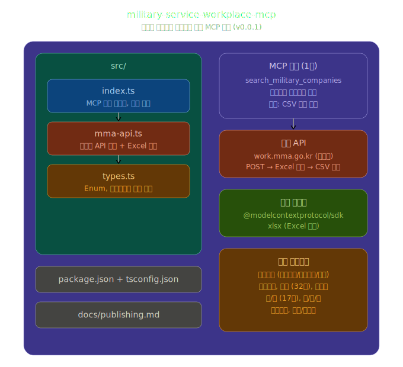
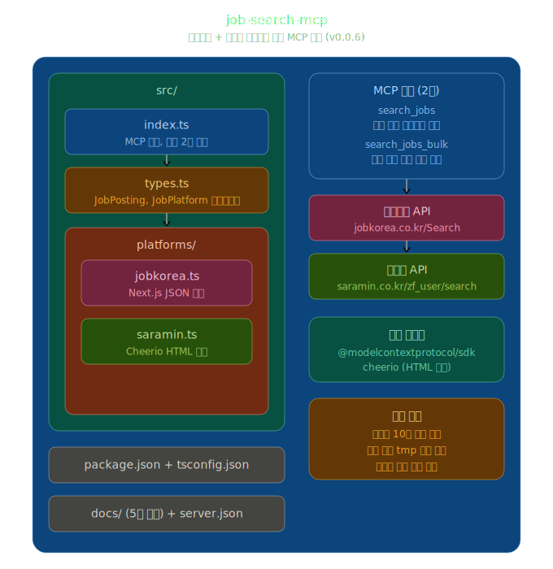
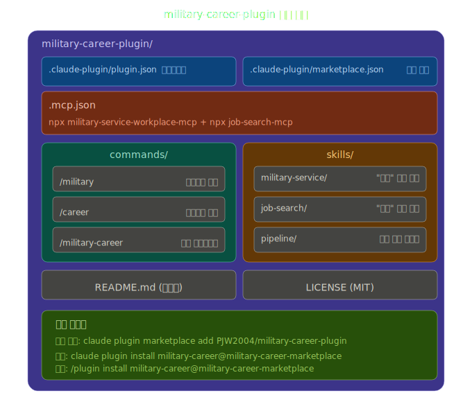

# military-career

병무청 병역일터 API와 잡코리아/사람인을 연동하여, 병역특례 지정업체를 검색하고 해당 업체의 실제 채용공고까지 한 번에 확인할 수 있는 플러그인입니다.

## 설치

### 마켓플레이스 등록 (최초 1회)

```bash
claude plugin marketplace add PJW2004/military-career-plugin
```

### 플러그인 설치

```bash
claude plugin install military-career@military-career-marketplace
```

또는 Claude Code 안에서:

```
/plugin install military-career@military-career-marketplace
```

## 사용법

### 슬래시 커맨드

#### `/military` : 병역특례 지정업체 검색

```
/military 산업기능요원 정보처리 서울
/military 전문연구요원 경기도 채용중
/military 산기 전자 대기업
/military 승선
```

#### `/career` : 채용공고 검색

```
/career 삼성전자
/career 네이버, 카카오, 라인
/career LG에너지솔루션 잡코리아
```

#### `/military-career` : 통합 파이프라인 (추천)

병역특례 지정업체를 검색한 뒤, 해당 업체들의 채용공고까지 자동으로 조회합니다.

```
/military-career 산업기능요원 정보처리 서울
/military-career 전문연구요원 경기도
/military-career 산기 게임SW 채용중
```

### 자연어 대화

슬래시 커맨드 없이도 자연스럽게 사용할 수 있습니다:

```
"경기도에 있는 정보처리 산업기능요원 업체 알려줘"
"네이버 채용공고 검색해줘"
"서울 전자업종 병역특례 업체 중에 지금 채용하는 곳 있어?"
```

## 검색 옵션

### 복무형태 (필수)
| 입력 | 복무형태 |
|------|----------|
| `산업기능요원`, `산기`, `산업` | 산업기능요원 |
| `전문연구요원`, `전문연구`, `연구` | 전문연구요원 |
| `승선근무예비역`, `승선` | 승선근무예비역 |

### 업종 (선택)
IT: `정보처리`, `전자`, `게임SW`, `영상게임`, `통신기기`
제조: `철강`, `기계`, `전기`, `화학`, `섬유` 등
기타: `의료의약`, `식음료`, `에너지`, `애니메이션` 등

### 지역 (선택)
`서울`, `경기`, `부산`, `대구`, `인천`, `대전`, `광주`, `울산`, `세종`, `충북`, `충남`, `전남`, `경북`, `경남`, `제주`, `강원`, `전북`

### 추가 필터
- `채용중` : 병무청에 채용공고를 등록한 업체만
- `대기업`, `중소기업`, `중견기업` : 기업 규모
- `현역`, `보충역` : 복무 구분

## 작동 원리

이 플러그인은 두 개의 MCP 서버를 연결합니다:

1. **military-service-workplace-mcp** : 병무청 병역일터 API에서 지정업체 목록을 Excel 형태로 받아 파싱
2. **job-search-mcp** : 잡코리아(Next.js JSON 파싱)와 사람인(HTML 스크래핑)에서 채용공고 검색

`/military-career` 커맨드는 이 두 서버를 순차적으로 호출하여 결과를 종합합니다.

## 관련 프로젝트

- [military-service-workplace-mcp](https://github.com/PJW2004/military-service-workplace-mcp) : 병무청 API MCP 서버
- [job-search-mcp](https://github.com/PJW2004/job-search-mcp) : 잡코리아/사람인 MCP 서버

## 아키텍처







## 라이선스

MIT
